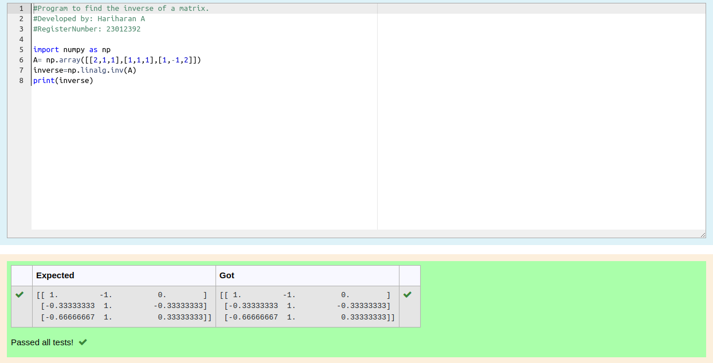

# INVERSE-OF-A-MATRIX
## Aim:
To write a python program to find the inverse of a matrix
## Equipment’s required:
1. 	Hardware – PCs
2. 	Anaconda – Python 3.7 Installation / Moodle-Code Runner
## Algorithm:
### Step1 : 
Start the program
### Step 2: 
Import numpy and enter the matrix values
### Step 3: 
using the np.linalg.inv(A), we can find the inverse of the given matrix
### Step 4: 
Stop the program
## Program:
```
#Program to find the inverse of a matrix.
#Developed by: Hariharan A
#RegisterNumber: 23012392

import numpy as np
A= np.array([[2,1,1],[1,1,1],[1,-1,2]])
inverse=np.linalg.inv(A)
print(inverse)
```
## Output:

## Result:
Thus the inverse of given matrix is successfully solved using python program

